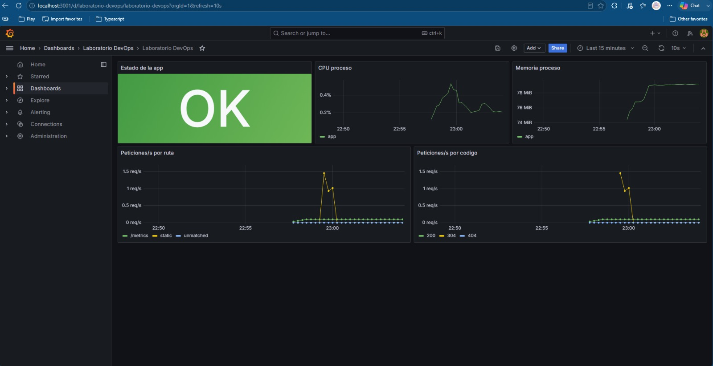
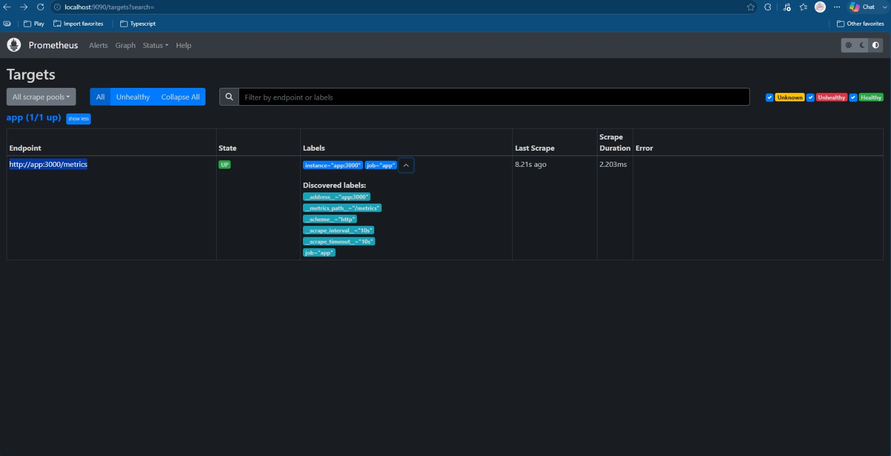
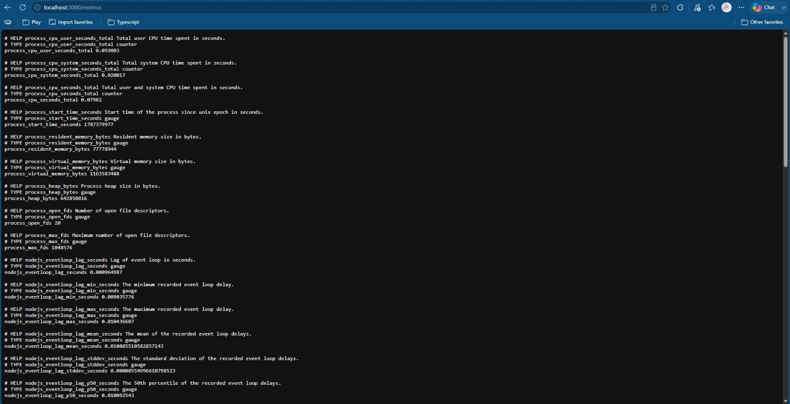
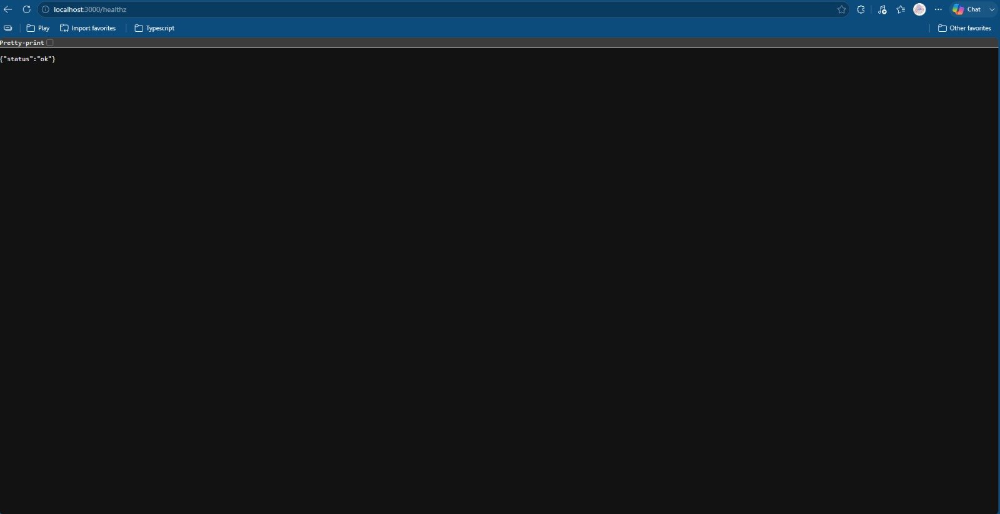
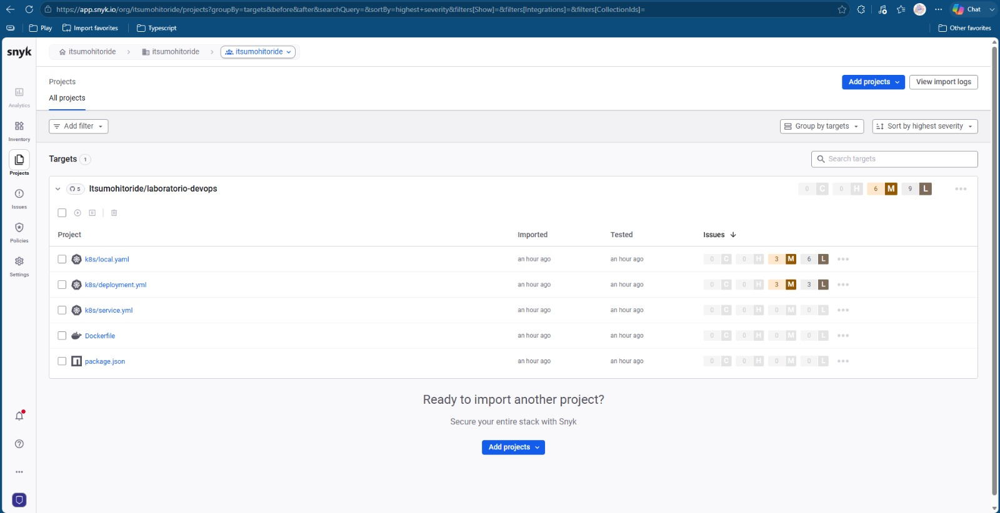
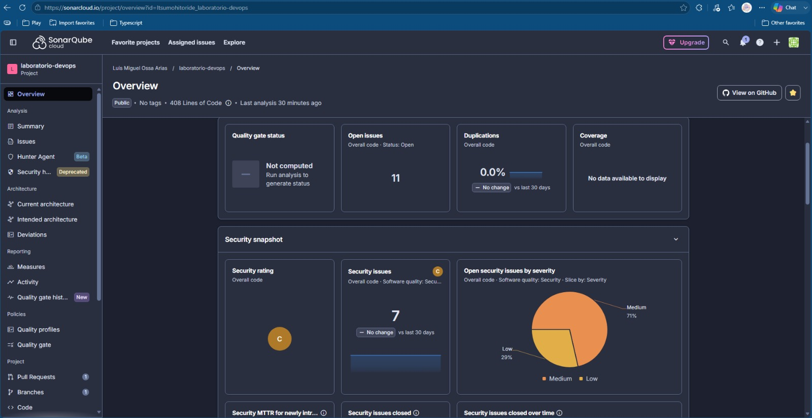
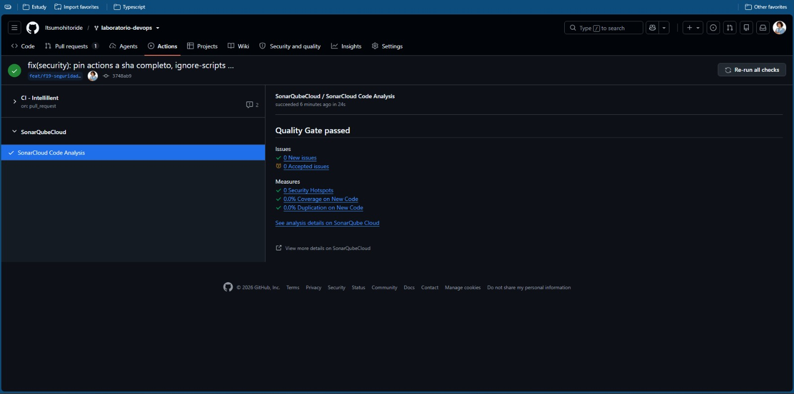
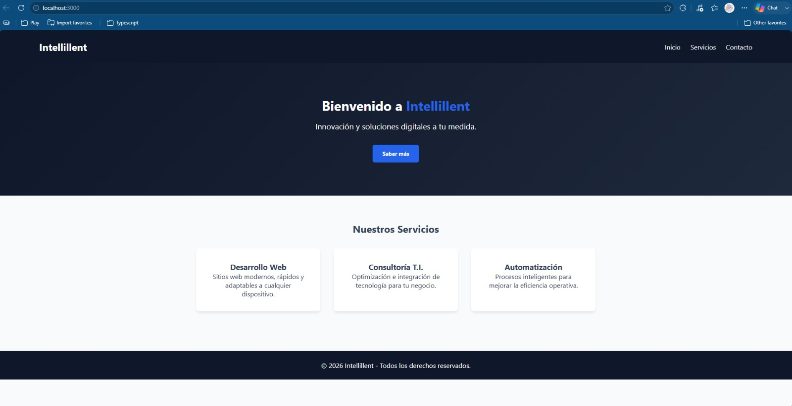

# Dashboard de monitoreo e informe de seguridad

## 1. Dashboard de monitoreo activo

Para realizar el seguimiento de la aplicación se implementó un sistema de monitoreo utilizando **Prometheus y Grafana**.

El objetivo es visualizar de manera sencilla el estado de la aplicación y algunos indicadores importantes, como el uso de CPU, memoria y las solicitudes recibidas.

### 1.1 Dashboard de Grafana

El dashboard de Grafana reúne las principales métricas de la aplicación en una sola vista.

En la captura se pueden observar:

- Estado de la aplicación.
- Uso de CPU.
- Uso de memoria.
- Peticiones por ruta.
- Peticiones por código de respuesta.

**Figura 1. Dashboard de monitoreo de la aplicación en Grafana.**

### 1.2 Estado de la aplicación

El indicador de estado permite verificar rápidamente si la aplicación se encuentra disponible.

En la captura se observa el estado **OK**, indicando que la aplicación está activa y siendo monitoreada correctamente.

### 1.3 Uso de CPU

Grafana permite observar el consumo de CPU de la aplicación durante el periodo monitoreado.

Esta información ayuda a identificar aumentos en el uso de recursos que puedan afectar el rendimiento.

### 1.4 Uso de memoria

También se monitorea el consumo de memoria de la aplicación.

Este indicador permite observar el comportamiento del consumo de memoria durante la ejecución.

### 1.5 Peticiones de la aplicación

El dashboard permite observar las peticiones realizadas a la aplicación, agrupadas por ruta y por código de respuesta.

Esto facilita identificar qué solicitudes están siendo atendidas y cuáles generan respuestas diferentes.

### 1.6 Validación en Prometheus

Prometheus tiene configurada la aplicación como un objetivo de monitoreo.

En la captura se observa el objetivo de la aplicación en estado **UP**, lo que indica que Prometheus puede consultar correctamente las métricas.

**Figura 6. Aplicación registrada como objetivo activo en Prometheus.**

### 1.7 Endpoint de métricas

La aplicación expone un endpoint `/metrics`, utilizado por Prometheus para obtener información sobre el comportamiento de la aplicación.

En la captura se observan métricas relacionadas con CPU, memoria y comportamiento del proceso de Node.js.

**Figura 7. Métricas expuestas por la aplicación.**

### 1.8 Endpoint de estado

La aplicación también dispone de un endpoint de comprobación de estado.

En la captura se observa la respuesta:

`{"status":"ok"}`

Esto permite comprobar de manera sencilla que el servicio está funcionando.

**Figura 8. Respuesta del endpoint de comprobación de estado.**

### 1.9 Acceso a las herramientas

En el entorno local, las herramientas pueden consultarse mediante:

- **Grafana:** `http://localhost:3001`
- **Prometheus:** `http://localhost:9090`

---

# 2. Informe de seguridad

Como parte del proyecto se realizaron análisis de seguridad y calidad del código utilizando **Snyk** y **SonarQube/SonarCloud**.

Estas herramientas permiten detectar posibles problemas de seguridad y ayudar a mejorar la calidad del proyecto.

---

## 2.1 Análisis con Snyk

Snyk fue utilizado para revisar los componentes y dependencias relacionados con el proyecto.

La captura muestra el proyecto `laboratorio-devops` dentro de Snyk y los componentes que fueron analizados.

**Figura 9. Proyecto y componentes analizados mediante Snyk.**

El uso de Snyk permite identificar vulnerabilidades conocidas en las dependencias y componentes utilizados por la aplicación.

### Recomendaciones

A partir de los resultados de Snyk se recomienda:

1. Revisar periódicamente las vulnerabilidades encontradas.
2. Mantener actualizadas las dependencias.
3. Dar prioridad a las vulnerabilidades de mayor gravedad.
4. Volver a ejecutar el análisis después de realizar actualizaciones.

---

## 2.2 Análisis con SonarQube/SonarCloud

También se realizó un análisis del código mediante SonarQube/SonarCloud.

La herramienta permite revisar aspectos relacionados con la seguridad y calidad del código.

En la captura del resumen se observan:

- **7 problemas de seguridad abiertos.**
- **Calificación de seguridad: C.**
- Los problemas de seguridad se distribuyen entre niveles **Medium** y **Low**.
- Se observan **11 problemas abiertos** en total.
- La duplicación de código mostrada es de **0.0%**.

**Figura 10. Resumen del análisis de seguridad y calidad en SonarQube/SonarCloud.**

### Recomendaciones

Los problemas identificados deben ser revisados y corregidos de acuerdo con su importancia.

Se recomienda dar prioridad a los problemas de seguridad de nivel **Medium** y posteriormente revisar los de nivel **Low**.

También se recomienda continuar ejecutando el análisis después de realizar cambios importantes en el código.

---

## 2.3 Resultado del Quality Gate

El análisis de SonarQube/SonarCloud también se encuentra integrado al pipeline.

En la captura se observa que el **Quality Gate fue aprobado (Passed)**.

Esto indica que la ejecución analizada cumplió las condiciones definidas para continuar dentro del proceso.

**Figura 11. Resultado del Quality Gate en el pipeline.**

El uso del Quality Gate permite establecer una validación automática de la calidad del código antes de continuar con las siguientes etapas del proceso.

---

# 3. Evidencia de funcionamiento de la aplicación

Como complemento a las evidencias de monitoreo, se incluye una captura de la página inicial de la aplicación funcionando correctamente.

**Figura 12. Página inicial de la aplicación.**

Esta evidencia permite comprobar que la aplicación se encuentra desplegada y accesible desde el entorno utilizado.

---

# 4. Recomendaciones generales

De acuerdo con las herramientas implementadas, se recomienda:

- Mantener actualizadas las dependencias del proyecto.
- Revisar periódicamente los resultados de Snyk.
- Corregir primero los problemas de seguridad de mayor importancia.
- Mantener activo el análisis de SonarQube/SonarCloud.
- Revisar los problemas de seguridad identificados por SonarQube.
- Continuar utilizando el pipeline para automatizar estas validaciones.
- Mantener el dashboard de Grafana para realizar seguimiento al estado de la aplicación.
- Incorporar nuevas alertas si en el futuro se requiere monitorear otros recursos.

---

# 5. Conclusión

La implementación realizada permite contar con herramientas de monitoreo y seguridad integradas al proyecto.

Por medio de **Grafana y Prometheus** se puede visualizar el estado de la aplicación, el consumo de CPU y memoria y el comportamiento de las peticiones.

Por otra parte, **Snyk y SonarQube/SonarCloud** permiten realizar revisiones de seguridad y calidad del código.

Las evidencias presentadas demuestran que el monitoreo está funcionando correctamente y que los análisis de seguridad se encuentran integrados al proceso de desarrollo. Como mejora, se recomienda continuar atendiendo los problemas de seguridad identificados y mantener actualizadas las dependencias del proyecto.
